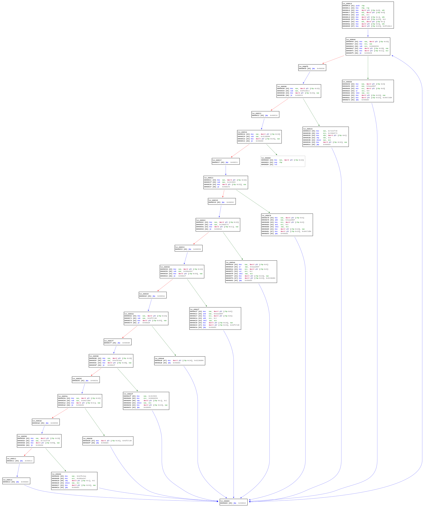
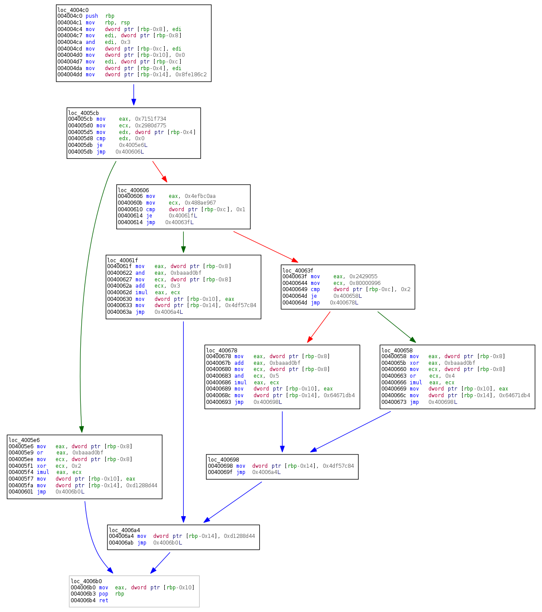

- 解决的问题：通过静态程序分析技术和动态符号执行技术来恢复经过Obfuscator-llvm混淆后的程序的CFG
- 工具：angr, barf
- 环境: python2.7
- 运行：python unflat <要恢复的二进制>
- 文件夹result里存储了得到的结果，其中target_function_origin.png是加混淆之后的CFG图，target_function.png是还原之后的CFG图，target_without_flat.png是程序未加混淆之后的CFG图

- Result

经过Obfuscator-llvm混淆后的CFG

经过该工具恢复的CFG

- Refenences

    - https://blog.quarkslab.com/deobfuscation-recovering-an-ollvm-protected-program.html

    - https://security.tencent.com/index.php/blog/msg/112